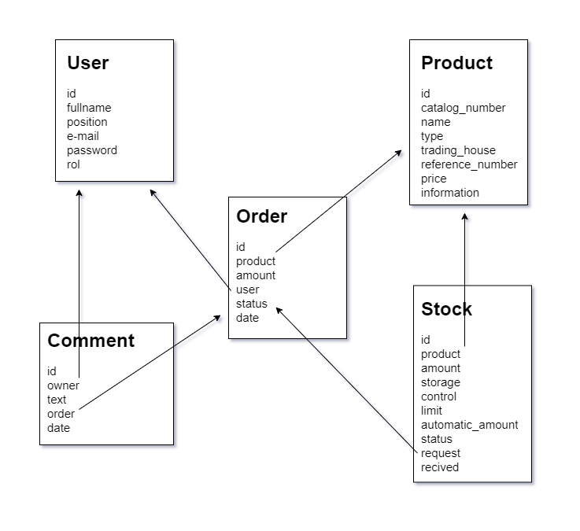

# **LabTool**

LabTool es una aplicación de gestión de pedidos principalmente en el ámbito de trabajo de un laboratorio aunque bien podría usarse en otro ámbito en el que se requiera un control de las solicitudes de compras, validación de pedidos y control de stock.
LabTool es el proyecto final que he elegido desarrollar correspondiente al bootcamp Let's Coder 2021.


## **Descripción funcional**

LabTool permite llevar un control de las solicitudes de pedidos realizadas y, mediante la validación del pedido por parte del usuario registrado como validador, autorizar la compra sólo a las solicitudes permitidas. LabTool también permite llevar un control del stock disponible en cada momento proporcionando información útil y actualizada del estado en que se encuentra cada producto para una mayor eficacia en su control. Las distintas funcionalidades que dispone la aplicación se detallan a contiuación:

### **SECCIÓN DE REGISTRO**
-**Registro** de los usuarios que harán uso de la aplicación y adquisición del rol **"validador"** o **"usuario"** dependiendo de si tendrá permisos de validador de solicitudes.

-**Inicio de sesión** de los usuarios registrados.

### **SECCIÓN DE PRODUCTOS**
-**Visualización de una base de datos donde se recogen todos los productos** disponibles para solicitar su compra con información sobre el número de catálogo, tipo, casa comercial, número de referencia, precio e información del producto. En este caso práctico, se trata de los productos ofertados por el servicio de suministros generales a los laboratorios en un centro de investigación. 

**Filtrar** la lista de productos según el tipo o realizar una búsqueda por nombre, número de catálogo o número de referencia.

**Agregar nuevos productos** que son ofertados por otra fuente y que son requeridos por el laboratorio mediante un formulario de registro.
**Visualizar la ficha del producto** seleccionado son su información y donde se puede solicitar una compra de una cantidad determinada por el formulario de solicitud. Además es posible modificar el campo de información del producto o eliminarlo de la base de datos.

-**Solicitud de compra** de un producto de la base de datos y visualización del estado en que se encuentran. Las solicitudes de compra podrán encontrarse en cuatros estados posibles;
* **En espera:** La solicitud se encuentra a la espera de ser revisada y validada por el usuario responsable.
* **Validada:** La solicitud ha sido validada por el usario responsable y es posible proceder a su compra.
* **Rechazada:** La solicitud ha sido rechazada por el usuario responsable.
* **Recibida:** La solicitud validada ha sido pedida y ha llegado a su destino.

-**Comentar** solicitudes de pedidos y visualizar los comentarios realizados por parte de otros usuarios.

-**Validación** de una solicitud de compra por parte del usuario resposable.

-**Rechazo** de una solicitud de compra por parte del usuario responsable.

-**Marcar como recibida** una solicitud y automáticamente actualizar el stock disponible.

-**Visualización del stock** disponible con información útil del estado de cada artículo como pueden ser:
<br>Conocer si se encuentra en stock o fuera de stock.
<br>Cantidad de unidades en stock.
<br>Lugar de almacenamiento.
<br>Conocer si se encuentra actualmente pedido.
<br>Fecha de llegada de la última reposición.

-**Establecer un límite** inferior de unidades en stock por el cual realizar una solicitud de pedido automática y de una cantidad determinada en caso de que el stock alcance dicho límite.


## **Esquema de relaciones**



## **Direccionamiento**

**Usuario:**

```
get user/ 
```
^ Ruta privada que devuelve todos los documentos de usuarios registrados.

```
post user/newuser 
```
^ Ruta pública que permite el regístro de usuarios con los parámetros validados de fullname(string), position(string), email(email-string), password(string) y rol("user"/"validator"). 
<br>Devuelve el documento creado.

```
get user/comment 
```
^ Ruta privada que devuelve los comentarios realizados en las solicitudes de compra por parte del usuario logueado.

```
delete user/deleteuser 
```
^ Ruta privada que elimina el documento del usuario logueado de la base de datos. 
<br>Devuelve un mensaje de confirmación.

```
put user/modify 
```
^ Ruta privada que permite modificar los parámetros de "fullname" y "position" en el documento del usuario logueado. 
<br>Devuelve un mensaje de confirmación.


**Producto:**

```
get product/ 
```
^ Ruta privada que devuelve los productos disponibles en la base de datos.

```
post product/newproduct 
```
^ Ruta privada que permite añadir un nuevo producto a la base de datos con los parámetros validados de catalog_number(number), name(string), type(string), trading_house(string), reference_number(string), price(number), information(string). 
<br>Devuelve el documento creado.

```
delete product/deleteproduct/id(producto) 
```
^ Ruta privada que requiere del id del producto a eliminar. Elimina el producto de la base de datos y devuele un mensaje de confirmación.


**Pedido:**

```
get order/ 
```
^ Ruta privada que devuelve todos los pedidos de la base de datos independientemente de su estado.

```
post order/neworder/id(producto) 
```
^ Ruta privada que requiere del id del producto a pedir (en la ruta) y de la cantidad (amount). Crea un documento de pedido con los parámetros validados de product(ObjectId), amount(number), user(ObjectId), status("waiting", por defecto) y date(date). 
<br>Al crear el documento se cambia el párametro "request" a "true" en el documento de este producto en el stock (si es que lo hubiera). 
<br>Devuelve el documento creado.

```
put order/validate/id(pedido) 
```
^ Ruta privada que requiere del id del pedido a validar (en la ruta). 
<br>Comprueba que el usuario logueado disponga de rol "validator" y si es así modifica el parámetro "status" a "validated" en el documento del pedido. 
<br>Devuelve un mensaje de confirmación.

```
put order/reject/id(pedido) 
```
^ Ruta privada que requiere del id del pedido a rechazar (en la ruta). 
<br>Comprueba que el usuario logueado disponga de rol "validator" y si es así modifica el parámetro "status" a "rejected" en el documento del pedido. 
<br>Devuelve un mensaje de confirmación.

```
delete order/deleteorder/id(pedido) 
```
^ Ruta privada que requiere del id del pedido a eliminar (en la ruta). 
<br>Elimina el documento del pedido en la base de datos y devuelve un mensaje de confirmación.

```
get order/waiting 
```
^ Ruta privada que devuelve los pedidos con status "waiting" a la espera de validación.

```
get /order/validated 
```
^ Ruta privada que devuelve los pedidos con status "validated".
```
get order/rejected 
```
^ Ruta privada que devuelve los pedidos con status "rejected".

```
get order/recived 
```
^ Ruta privada que devuelve los pedidos con status "recived".


**Comentarios:**

```
get comment/ 
```
^ Ruta privada que devuelve todos los comentarios.

```
get comment/id(pedido) 
```
^ Ruta privada que requiere del id del pedido (en la ruta) para mostrar los comentarios asociados a ese pedido. Devuelve los documentos de comentarios de ese pedido.

```
post comment/newcomment/id(pedido) 
```
^ Ruta privada que requiere del id del pedido a comentar(en la ruta). 
<br>Crea un documento de comentario en la base de datos con los parámetros validados text(string), owner(ObjectId), order(ObjectId), date(date). 
<br>Devuelve el documento creado.

```
delete comment/deletecomment/id(comentario) 
```
^ Ruta privada que requiere del id del comentario a eliminar (en la ruta). 
<br>Comprueba que el comentario pertenece al usuario logueado y si es así lo elimina de la base de datos. 
<br>Devuelve un mensaje de confirmación.


**Stock:**
```
get stock/ 
```
^ Ruta privada que devuelve los ítems guardados en stock.

```
post stock/newitem/id(pedido) 
```
^ Ruta privada que requiere del id del pedido con status "validated" y que ya se disponga de él para añadirlo al stock. Si es la primera vez que el producto entra al stock se crea un nuevo documento en el que algunos parámetro se toman a partir de la información del pedido: product(ObjectId), amount(number), status("In stock"), request("false", por defecto), recived(date) y storage(string). 
<br>En caso de ya estar registrado este producto en el stock se actualizarán los parámetros "amount", "status" y "recived" en el documento ya existente. 
<br>Al mismo tiempo se modifica el status del pedido a "recived" y también se comprueba si existen más pedidos en estado "waiting" o "validated" de ese mismo producto y, de ser así, establece el parámetro "request" del ítem en "true". 
<br>Devuelve el documento creado o un mensaje de confirmación de la actualización del ítem.

```
put stock/reduce/id(ítem) 
```
^ Ruta privada que reduce la cantidad del ítem en el stock en una unidad. En caso de alcanzar 0 unidades modifica el status del ítem a "Out of stock". 
<br>LÍMITE -> En caso de que el ítem tenga el parámetro "control" establecido en "true", la cantidad de ítem alcance el valor del parámetro "limit" y que no exista actualmente un pedido automático en estado "waiting" o "validated", se crea un nuevo pedido automático con la cantidad establecida en el parámero "automaticamount". 
<br>Al mismo tiempo modifica el parámetro "request" del ítem a "true". 
<br>Devuelve un mensaje de confirmación de cantidad reducida o cantidad reducida y pedido automático creado.

```
put stock/id(ítem)/modify 
```
^ Ruta privada que requiere del id del ítem a modificar (en la ruta). 
<br>Permite modificar los parámetros validados de amount(number), storage(string), limit(number), control(boolean), automaticamount(number) del ítem. 
<br>En caso de no especificar alguno se mantendrá con el valor en el que se encontraban. 
<br>Devuelve un mensaje de confiración de la modificación.

```
delete stock/deleteitem/id(ítem) 
```
^ Ruta privada que elimina el ítem de la base de datos. 
<br>Devuelve un mensaje de confirmación. 


**Login:**
```
post login/ 
```
^ Ruta pública que permite loguearse a través de los parámetros "email" y "password" del usuario. 
<br>En caso de confirmación devuelve un token válido por 24 horas con información del usuario ("id","fullname", "position" y "rol").


## **Tecnologías usadas**

- `Node.js v14.16.0.`
- `MongoDB`

## **Dependencias**

- `bcrypt: ^5.0.1`
- `dotenv: ^8.2.0`
- `express: ^4.17.1`
- `jsonwebtoken: ^8.5.1`
- `mongoose: ^5.11.18`
- `nodemon: ^2.0.7`
- `validator: ^13.5.2`

## **TO DO**

- Implementar sólo un usuario validador o administrador que pueda establecer el rol de validador a otro usuario.
- Si se crea un pedido nuevo y ya hay uno en estado "waiting" preguntar y sumar las cantidad en caso de aceptación.
- Establecer ruta independiente para el establecimiento del control de límite de stock donde modificar los parámetros correspondientes.
- Mejora del código en general. Refactoring.
- Implementación de frontend.